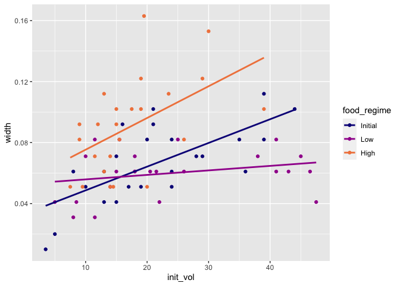
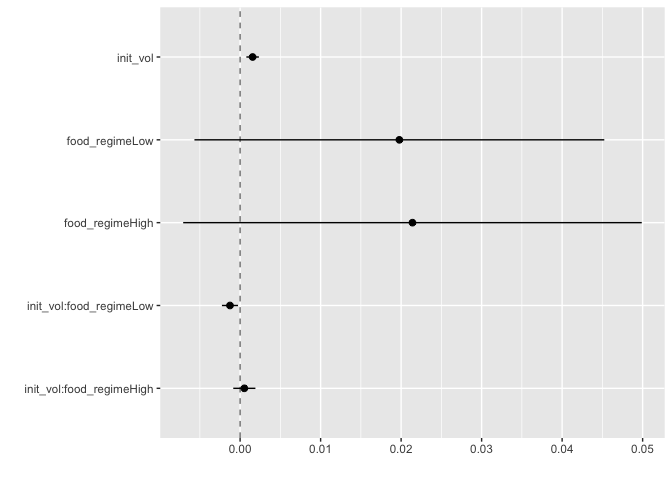
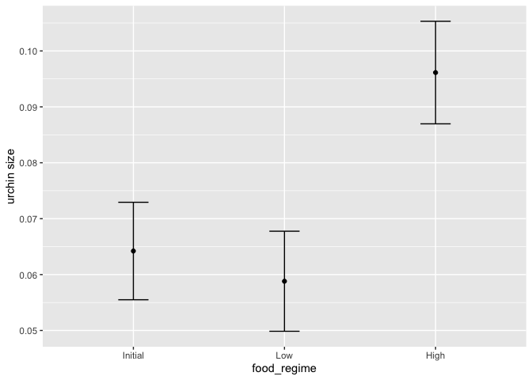
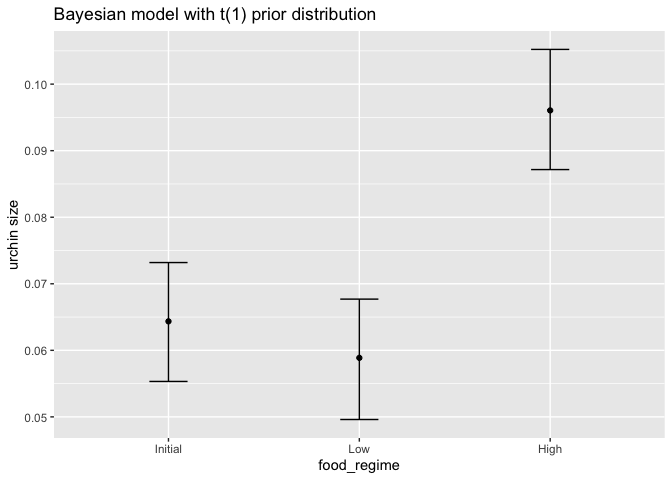

Tidymodels
================

## Intro

This notebook contains a walkthrough of the [tidymodels
vignette](https://www.tidymodels.org/start/) and answers to the study
questions provided by Jen Fisher for Oct 7th Stats Club! This article
walks thorugh the steps of creating statistical models using this
package.

## Build a model

For this section we will:

-   Check out our data (Sea urchins!)
-   learn how to specify and train models with different engines
    (parsnip)
-   understand the function designs

``` r
library(tidymodels)  # for the parsnip package, along with the rest of tidymodels
```

    ## ── Attaching packages ────────────────────────────────────── tidymodels 1.0.0 ──

    ## ✔ broom        1.0.1     ✔ recipes      1.0.1
    ## ✔ dials        1.0.0     ✔ rsample      1.1.0
    ## ✔ dplyr        1.0.9     ✔ tibble       3.1.7
    ## ✔ ggplot2      3.3.6     ✔ tidyr        1.2.0
    ## ✔ infer        1.0.3     ✔ tune         1.0.0
    ## ✔ modeldata    1.0.1     ✔ workflows    1.1.0
    ## ✔ parsnip      1.0.2     ✔ workflowsets 1.0.0
    ## ✔ purrr        0.3.4     ✔ yardstick    1.1.0

    ## ── Conflicts ───────────────────────────────────────── tidymodels_conflicts() ──
    ## ✖ purrr::discard() masks scales::discard()
    ## ✖ dplyr::filter()  masks stats::filter()
    ## ✖ dplyr::lag()     masks stats::lag()
    ## ✖ recipes::step()  masks stats::step()
    ## • Search for functions across packages at https://www.tidymodels.org/find/

``` r
library(tidyverse)
```

    ## ── Attaching packages ─────────────────────────────────────── tidyverse 1.3.1 ──

    ## ✔ readr   2.0.2     ✔ forcats 0.5.1
    ## ✔ stringr 1.4.0

    ## ── Conflicts ────────────────────────────────────────── tidyverse_conflicts() ──
    ## ✖ readr::col_factor() masks scales::col_factor()
    ## ✖ purrr::discard()    masks scales::discard()
    ## ✖ dplyr::filter()     masks stats::filter()
    ## ✖ stringr::fixed()    masks recipes::fixed()
    ## ✖ dplyr::lag()        masks stats::lag()
    ## ✖ readr::spec()       masks yardstick::spec()

``` r
# Helper packages
library(readr)       # for importing data
library(broom.mixed) # for converting bayesian models to tidy tibbles
library(dotwhisker)  # for visualizing regression results
```

### The data

This urchin data set is from
[Constable(1993)](https://link.springer.com/article/10.1007/BF00349318),
investigating how three different feeding regimes affect body size
temporally. Starting urchin size likely affects growth increases based
on food intake.

``` r
urchins <- read_csv("https://tidymodels.org/start/models/urchins.csv") %>% 
  setNames(c("food_regime","init_vol", "width")) %>%
  mutate(food_regime = factor(food_regime, levels = c("Initial","Low","High")))
```

    ## Rows: 72 Columns: 3
    ## ── Column specification ────────────────────────────────────────────────────────
    ## Delimiter: ","
    ## chr (1): TREAT
    ## dbl (2): IV, SUTW
    ## 
    ## ℹ Use `spec()` to retrieve the full column specification for this data.
    ## ℹ Specify the column types or set `show_col_types = FALSE` to quiet this message.

It’s important to look at your data, understand your categories and
variables, and visualize or plot your data

``` r
head(urchins)
```

    ## # A tibble: 6 × 3
    ##   food_regime init_vol width
    ##   <fct>          <dbl> <dbl>
    ## 1 Initial          3.5 0.01 
    ## 2 Initial          5   0.02 
    ## 3 Initial          8   0.061
    ## 4 Initial         10   0.051
    ## 5 Initial         13   0.041
    ## 6 Initial         13   0.061

``` r
summary(urchins)
```

    ##   food_regime    init_vol         width        
    ##  Initial:24   Min.   : 3.50   Min.   :0.01000  
    ##  Low    :24   1st Qu.:13.00   1st Qu.:0.05100  
    ##  High   :24   Median :18.00   Median :0.07100  
    ##               Mean   :20.88   Mean   :0.07237  
    ##               3rd Qu.:26.00   3rd Qu.:0.08450  
    ##               Max.   :47.50   Max.   :0.16300

``` r
table(urchins$food_regime)
```

    ## 
    ## Initial     Low    High 
    ##      24      24      24

``` r
ggplot(urchins,
       aes(x = init_vol, y = width, group = food_regime, color = food_regime)) +
  geom_point()+
  geom_smooth(method = lm, se = F)+
  scale_color_viridis_d(option = "plasma", end = 0.7)
```

    ## `geom_smooth()` using formula 'y ~ x'

<!-- -->

Here we see that for most food regimes, there is a higher suture width
for organisms with higher initial weights. the differences in slope
indicate that this is food_regime dependent.

### Build and fit a model

We have one categorical and one continous variable, which a two-way
ANOVA is suitable for. Based on the previous plot, we will need to
include interactions

``` r
width ~ init_vol * food_regime
```

    ## width ~ init_vol * food_regime

We can use OLS an specify the functional form with the parsnip package.
This would be alinear regression since we have a numeric outcome and an
expectation of linearity

``` r
linear_reg()
```

    ## Linear Regression Model Specification (regression)
    ## 
    ## Computational engine: lm

Here we could change the model engine, or software that can be used to
fit or train the model and estimation method. Learn about other engines
in the documentation.

``` r
lm_mod <- linear_reg()
# saving the model object

lm_fit <- lm_mod %>% 
  fit(width ~ init_vol * food_regime, data = urchins)
#estimate or train model
```

I want a data frame with standard column names for my results…but
summary can’t give that to me

``` r
summary(lm_fit$fit)
```

    ## 
    ## Call:
    ## stats::lm(formula = width ~ init_vol * food_regime, data = data)
    ## 
    ## Residuals:
    ##       Min        1Q    Median        3Q       Max 
    ## -0.045133 -0.013639  0.001111  0.013226  0.067907 
    ## 
    ## Coefficients:
    ##                            Estimate Std. Error t value Pr(>|t|)    
    ## (Intercept)               0.0331216  0.0096186   3.443 0.001002 ** 
    ## init_vol                  0.0015546  0.0003978   3.908 0.000222 ***
    ## food_regimeLow            0.0197824  0.0129883   1.523 0.132514    
    ## food_regimeHigh           0.0214111  0.0145318   1.473 0.145397    
    ## init_vol:food_regimeLow  -0.0012594  0.0005102  -2.469 0.016164 *  
    ## init_vol:food_regimeHigh  0.0005254  0.0007020   0.748 0.456836    
    ## ---
    ## Signif. codes:  0 '***' 0.001 '**' 0.01 '*' 0.05 '.' 0.1 ' ' 1
    ## 
    ## Residual standard error: 0.02115 on 66 degrees of freedom
    ## Multiple R-squared:  0.4622, Adjusted R-squared:  0.4215 
    ## F-statistic: 11.35 on 5 and 66 DF,  p-value: 6.424e-08

``` r
tidy(lm_fit)
```

    ## # A tibble: 6 × 5
    ##   term                      estimate std.error statistic  p.value
    ##   <chr>                        <dbl>     <dbl>     <dbl>    <dbl>
    ## 1 (Intercept)               0.0331    0.00962      3.44  0.00100 
    ## 2 init_vol                  0.00155   0.000398     3.91  0.000222
    ## 3 food_regimeLow            0.0198    0.0130       1.52  0.133   
    ## 4 food_regimeHigh           0.0214    0.0145       1.47  0.145   
    ## 5 init_vol:food_regimeLow  -0.00126   0.000510    -2.47  0.0162  
    ## 6 init_vol:food_regimeHigh  0.000525  0.000702     0.748 0.457

Now I can generate plots directly from the the model object:

``` r
tidy(lm_fit) %>% 
  dwplot(dot_args = list(size = 2, color = "black"),
         whisker_args = list(color = "black"),
         vline = geom_vline(xintercept = 0, colour = "grey50", linetype = 2))
```

<!-- -->

## Use a model to predict

`lm_fit` has the `lm` model output that can be accessed with
`lm_fit$fit`, but this model is useful (from parsnip) predictions. Let’s
make a plot of mean body size for urchins starting with an initial
volume of 20ml.

``` r
new_points <- expand.grid(init_vol = 20, 
                          food_regime = c("Initial", "Low", "High"))
new_points
```

    ##   init_vol food_regime
    ## 1       20     Initial
    ## 2       20         Low
    ## 3       20        High

``` r
# some subset example data
```

Now we will use `predict()` to find mean values at 20ml and confidence
intervals. We can do this with other functions, but the beauty of
`tidymodels` is if we change models, we can keep the same syntax!

``` r
mean_pred <- predict(lm_fit, new_data = new_points)
mean_pred
```

    ## # A tibble: 3 × 1
    ##    .pred
    ##    <dbl>
    ## 1 0.0642
    ## 2 0.0588
    ## 3 0.0961

Now we can combine the original data with the predictions! Combine
predictions with confidence intervals.

``` r
conf_int_pred <- predict(lm_fit, 
                         new_data = new_points, 
                         type = "conf_int")
conf_int_pred
```

    ## # A tibble: 3 × 2
    ##   .pred_lower .pred_upper
    ##         <dbl>       <dbl>
    ## 1      0.0555      0.0729
    ## 2      0.0499      0.0678
    ## 3      0.0870      0.105

``` r
# generate confidence intervals

plot_data <- 
  new_points %>% 
  bind_cols(mean_pred) %>% 
  bind_cols(conf_int_pred)
# combine predictions and confidence intervals

ggplot(plot_data, aes(x = food_regime)) + 
  geom_point(aes(y = .pred)) + 
  geom_errorbar(aes(ymin = .pred_lower, 
                    ymax = .pred_upper),
                width = .2) + 
  labs(y = "urchin size")
```

<!-- -->

``` r
# plot it!
```

## Model with different engine

What if we end up wanting to use a different approach, for example a
Bayesian analysis?

After we set the prior distribution, all of the other steps are pretty
much the same! Note the `set_engine` function provided that prior
information.

``` r
# set the prior distribution
prior_dist <- rstanarm::student_t(df = 1)

set.seed(123)

# make the parsnip model
bayes_mod <-   
  linear_reg() %>% 
  set_engine("stan", 
             prior_intercept = prior_dist, 
             prior = prior_dist) 

# train the model
bayes_fit <- 
  bayes_mod %>% 
  fit(width ~ init_vol * food_regime, data = urchins)

print(bayes_fit, digits = 5)
```

    ## parsnip model object
    ## 
    ## stan_glm
    ##  family:       gaussian [identity]
    ##  formula:      width ~ init_vol * food_regime
    ##  observations: 72
    ##  predictors:   6
    ## ------
    ##                          Median   MAD_SD  
    ## (Intercept)               0.03338  0.00947
    ## init_vol                  0.00155  0.00039
    ## food_regimeLow            0.01936  0.01348
    ## food_regimeHigh           0.02073  0.01395
    ## init_vol:food_regimeLow  -0.00125  0.00052
    ## init_vol:food_regimeHigh  0.00055  0.00069
    ## 
    ## Auxiliary parameter(s):
    ##       Median  MAD_SD 
    ## sigma 0.02143 0.00180
    ## 
    ## ------
    ## * For help interpreting the printed output see ?print.stanreg
    ## * For info on the priors used see ?prior_summary.stanreg

``` r
tidy(bayes_fit, conf.int = TRUE)
```

    ## # A tibble: 6 × 5
    ##   term                      estimate std.error  conf.low conf.high
    ##   <chr>                        <dbl>     <dbl>     <dbl>     <dbl>
    ## 1 (Intercept)               0.0334    0.00947   0.0171    0.0493  
    ## 2 init_vol                  0.00155   0.000392  0.000885  0.00222 
    ## 3 food_regimeLow            0.0194    0.0135   -0.00178   0.0417  
    ## 4 food_regimeHigh           0.0207    0.0140   -0.00287   0.0457  
    ## 5 init_vol:food_regimeLow  -0.00125   0.000520 -0.00211  -0.000389
    ## 6 init_vol:food_regimeHigh  0.000551  0.000688 -0.000651  0.00168

``` r
bayes_plot_data <- 
  new_points %>% 
  bind_cols(predict(bayes_fit, new_data = new_points)) %>% 
  bind_cols(predict(bayes_fit, new_data = new_points, type = "conf_int"))

ggplot(bayes_plot_data, aes(x = food_regime)) + 
  geom_point(aes(y = .pred)) + 
  geom_errorbar(aes(ymin = .pred_lower, ymax = .pred_upper), width = .2) + 
  labs(y = "urchin size") + 
  ggtitle("Bayesian model with t(1) prior distribution")
```

<!-- -->

## Study Questions:

1.  What is tidymodels and what is it used for?

tidymodels is a meta-package for working with statistical models

2.  Why tidymodels over other methods for building machine learning
    models?

standardizing the many iterations and tunings characteristic to ML
models

3.  What type of models can you build with tidymodels?

All kinds! bayesian, lm, glm, DA models, mixed models (parsnip)

4.  How can you evaluate models in tidymodels? Have two examples ready
    for discussion.

You can use resample. You can split your data set into training and test
sets and resample the training set. Things can be evaluated and compared
with ROC and accuracy metrics in `yardstick`

5.  What are the different packages in tidymodels?

-   `parsnip` for building models
-   `rsample` for resampling and evaluating model prediction
-   `recipes` for pre-processing data
-   `tune` for optimizing hyperparameters from model
-   `workflows` for building workkflows from pre-processing, modeling,
    to post-processing (string it together)

6.  What do think are the three most interesting or most useful packages
    in tidymodels?

recipes, parsnips, workflow

7.  Where could you apply tidymodels in your own research (or future
    research)?
